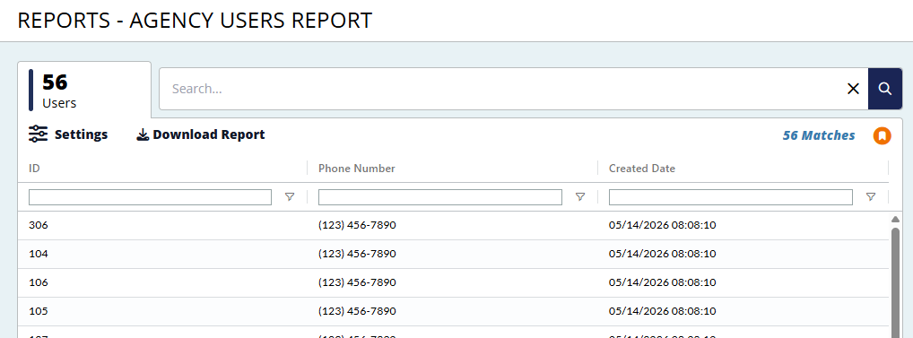

This page populates the ag-grid with data from Elasticsearch and each of the columns is filterable and sortable (based on both the ag-grid configuration AND the ES mapping).  The search function 
will search for matches across the fields and will also turn red if the search term is invalid (e.g. searching for "this AND that NOT this").  The grid page also contains code in the "Settings" button
to reset and resize the grid.  There is also the ability to download the report.  
Lastly, the page shows how many users are returned (in the top left) but ALSO how many matches are returned for your search - in this image there is no active search so the number of matches is equal
to the number of returned users

    

      <!-- Header Bar Div Column -->
      

        {{Constants.APPLICATION_NAME}} - Users Report
      

    
      <!-- Page Content Wrapper -->
      

    <!-- Page Content Div Column -->
    

      <!-- Tab & Search Row -->
      

        <!-- Tab -->
        

          

          <!-- Note: Negative margin here because of line height on the numbers -->
          

            

              <!-- Title (count) -->
              <ng-container>
                {{this.totalMatchesOnPageLoad}}
              </ng-container>
            

            

              <!-- Sub Title (context) -->
              Users
            

          

        

        <!-- Searchbar Container -->
        

          <!-- Searchbar -->
          

            <!-- Search box -->
            <input matInput type="text" #searchBox
                   class="w-full outline-none"
                   placeholder="Search..."
                   autocomplete="off"
                   title="Search Box"
                   [ngClass]="{
                      'searchBoxValid':    this.isValidQuery,
                      'searchBoxInvalid':  !this.isValidQuery
                       }"
                   [(ngModel)]="this.rawSearchQuery" (keyup.enter)="this.runSearch()"
                   aria-label="Search Box"/>

            <!-- Clear Icon -->
            
              <i class="fa-solid fa-xmark-large"></i>
            

            <!-- Search Icon -->
            

              <i class="fa-regular fa-search"></i>
            

          

        

      

      <!-- Searchbar Column -->
      

        

          <!-- L E F T      S I D E     O F     R O W  -->

          <!-- Grid Options Popup Menu -->
          <button rbr-stripped-button no-hover class="-ml-1"
                  [matMenuTriggerFor]="myMenu"
                  type="button" title="Settings" aria-label="Settings">
            <i class="fa-xl fa-solid fa-sliders"></i>
            Settings
          </button>

          <mat-menu #myMenu="matMenu">
            <button mat-menu-item title="Reset Grid" aria-label="Reset Grid" (click)="this.resetGrid()">Reset Grid
            </button>
            <button mat-menu-item title="Autosize Grid" aria-label="Autosize Grid" (click)="this.autoSizeGrid()">
              Autosize Grid
            </button>
          </mat-menu>

          <button (click)="this.downloadReport()" rbr-stripped-button no-hover
                  type="button" title="Download Users Report" aria-label="Download Users Report">
            

              <i class="fa fa-download"></i>
              Download Report
            

          </button>

        

        

          <!-- C E N T E R      S I D E     O F     R O W  -->
        

        

          <!-- R I G H T      S I D E     O F     R O W  -->

          <!-- Show the Total Number of Matches -->
          

            {{ this.displayedTotalMatches }}
            <app-grid-preference-check [saveGridColumnStateEventsSubject]="this.saveGridColumnStateEventsSubject"></app-grid-preference-check>
          

        

      

      <!-- Grid Container Column -->
      

        

          <ag-grid-angular
            style="width: 100%; height: 100%;"
            class="ag-theme-balham"
            [class.single-select]="gridOptions.rowSelection === 'single'"
            [gridOptions]="this.gridOptions"
            [columnDefs]="this.columnDefs"
            [defaultColDef]="this.defaultColDefs"
            (firstDataRendered)="this.firstDataRendered()"
            (gridReady)="this.onGridReady($event)">
          </ag-grid-angular>
        

      

    

     
`
